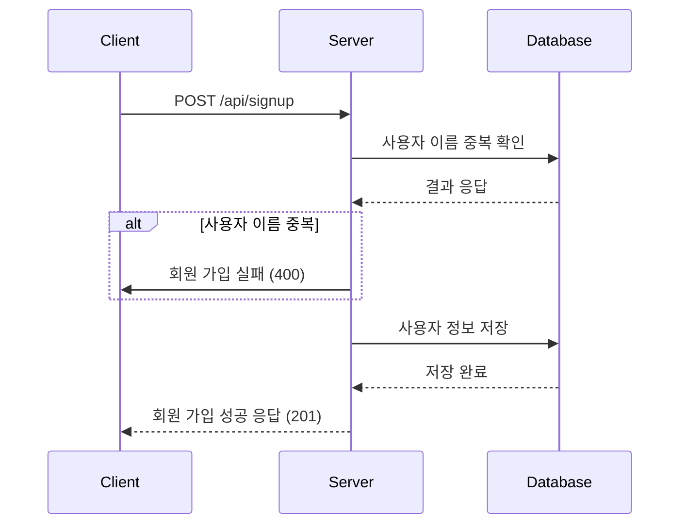
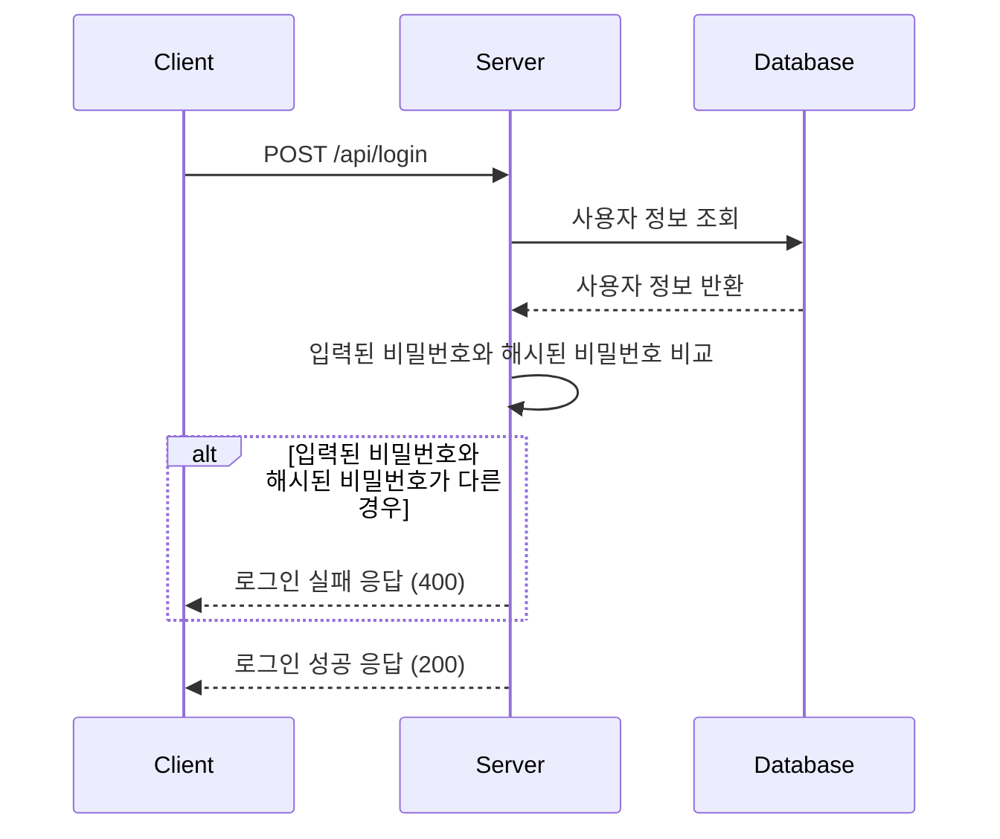
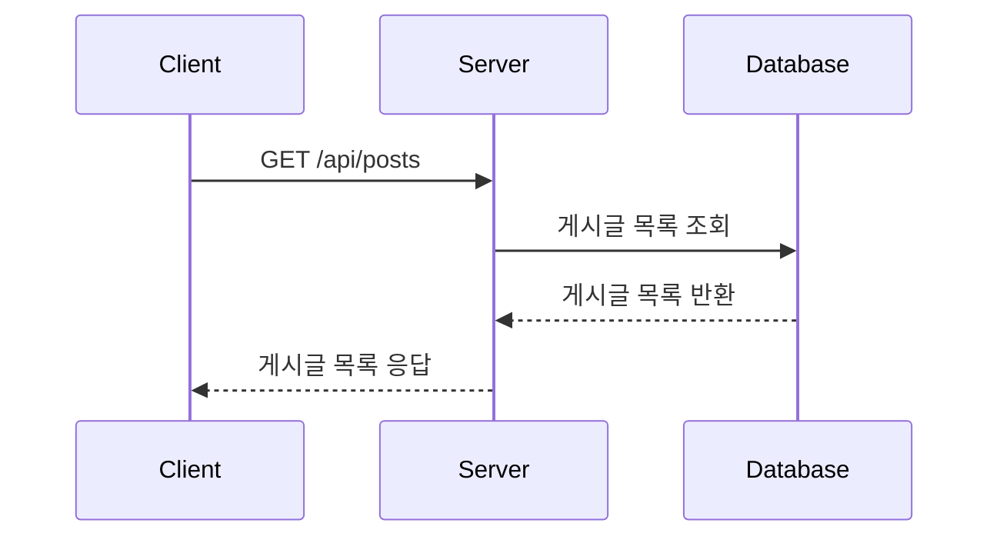
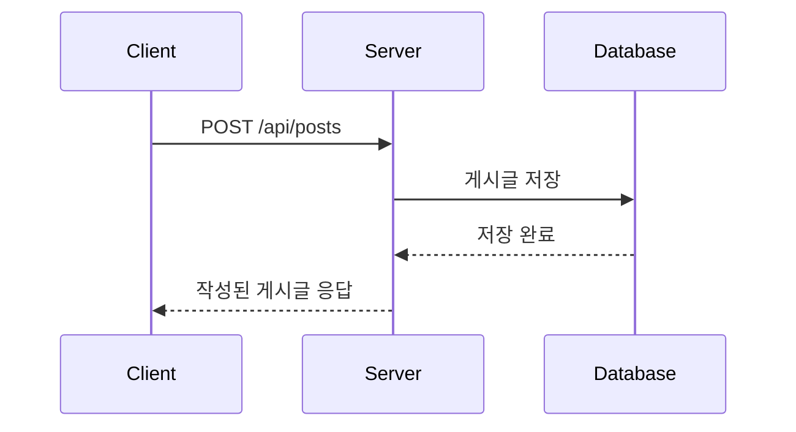
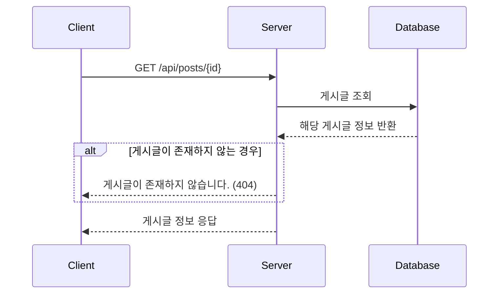
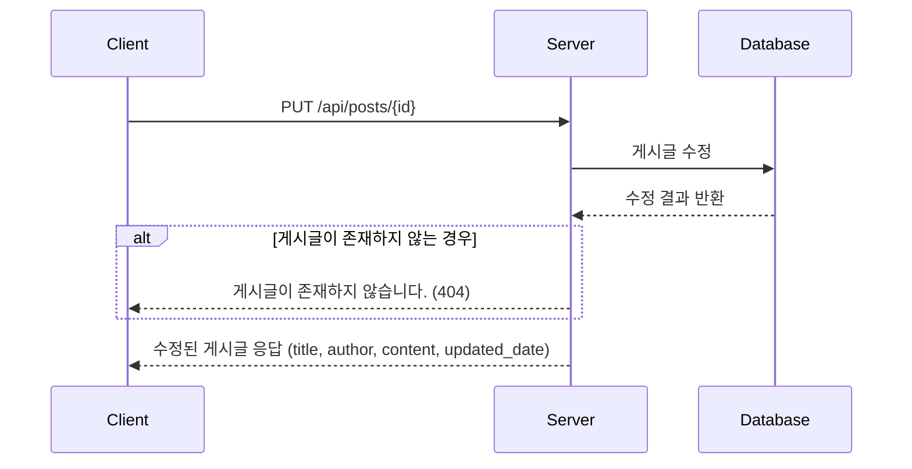
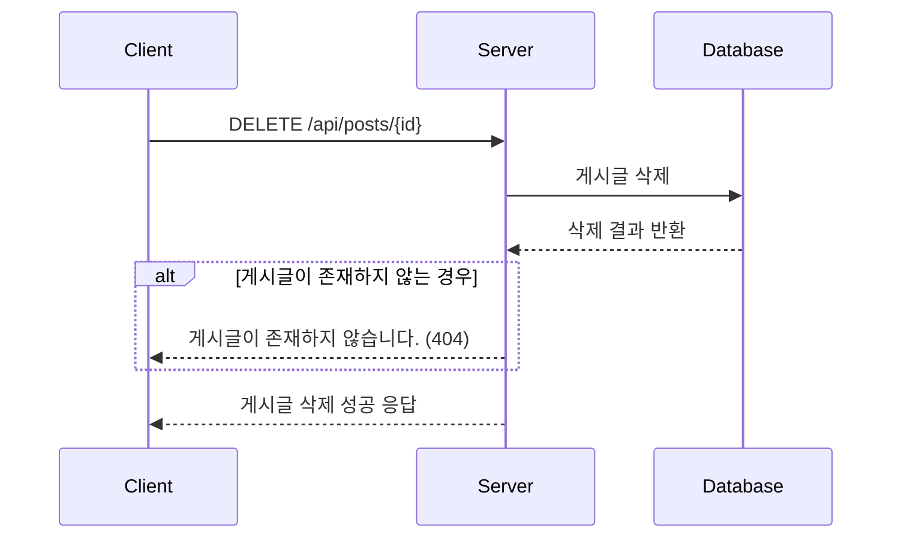

# 게시판 서비스

## API 문서 주소
실행 후

- http://localhost:8080/docs/index.html

## 기능

- 회원가입
    - 사용자 이름, 비밀번호를 입력받아 회원 가입을 진행합니다.
        - 사용자 이름은 `최소 4자 이상, 10자 이하이며 알파벳 소문자(a ~ z), 숫자(0 ~ 9)`로 구성되어야 합니다.
        - 비밀번호는 `최소 8자 이상, 15자 이하이며 알파벳 대소문자(a ~ z, A~Z), 숫자(0~9)`로 구성되어야 합니다.
        - DB에 중복된 사용자 이름이 없다면 회원을 저장합니다.
- 로그인
    - DB에서 사용자 이름을 사용하여 저장된 회원의 유무를 확인하고 있다면 비밀번호를 비교하기
    - 로그인 성공시, 로그인에 성공한 유저의 정보와 JWT를 활용하여 토큰을 발급하고, 발급한 토큰을 헤더에 추가해서 반환합니다.
- 게시글 작성
    - 제목, 작성 내용을 저장하고 저장된 게시글을 반환
- 게시글 목록 조회
    - 제목, 작성자명, 작성 내용, 작성 날짜를 조회
    - 작성 날짜 기준 내림차순으로 정렬
- 게시글 단일 조회
    - 선택한 게시글 제목, 작성자명, 작성 날짜, 작성 내용 조회
- 게시글 수정
    - 수정시 로그인한 작성한 사용자가 맞는지 검증 진행
    - 제목, 작성 내용을 수정하고 수정된 게시글을 반환
- 게시글 삭제
  - 삭제를 요청할 때 작성한 사용자가 맞는지 검증 진행
  - 선택한 게시글 삭제
    

## 패키지 구조

```
├── application : 비즈니스 로직을 처리하는 유즈케이스를 구현
│   ├── post : 게시글 관련 유즈케이스
│   └── user : 사용자 관련 유즈케이스
├── common
│   └── exception : 공통 예외 처리
├── domain : 핵심 비즈니스 로직을 처리하는 도메인 정의
│   ├── post : 게시글 관련 도메인
│   │   ├── exception : 게시글 관련 예외
│   │   ├── model : 게시글 도메인 모델 정의
│   │   └── port : 게시글 관련 외부 시스템 연동 인터페이스
│   └── user : 사용자 관련 도메인
│       ├── exception : 사용자 관련 예외
│       ├── model : 사용자 도메인 모델 정의
│       └── port : 사용자 관련 외부 시스템 연동 인터페이스
└── infrastructure : 외부 시스템과의 연동을 처리
    ├── auth : 인증 및 보안 관련 설정
    ├── persistence : 데이터 영속화 관련 처리
    │   ├── post : 게시글 관련 데이터 영속화
    │   └── user : 사용자 관련 데이터 영속화
    └── web : 웹 계층 구현 (Controller)
        └── rest : REST API 컨트롤러
            ├── post : 게시글 관련 REST API 컨트롤러
            └── user : 사용자 관련 REST API 컨트롤러
```

## API 설계

| 기능           | Path              | Method |
|--------------|-------------------|--------|
| 회원 가입        | `/api/signup`     | POST   |
| 로그인          | `/api/login`      | POST   |
| 전체 게시글 목록 조회 | `/api/posts`      | GET    |
| 게시글 작성       | `/api/posts`      | POST   |
| 선택한 게시글 조회   | `/api/posts/{id}` | GET    |
| 선택한 게시글 수정   | `/api/posts/{id}` | PUT    |
| 선택한 게시글 삭제   | `/api/posts/{id}` | DELETE |

### 회원 가입



- 요청
    ```
  {
      "username": "사용자 이름",
      "password": "사용자 패스워드"
    }
  ```
- 응답
    ```
  {
      "status": "201"
      "message": "회원 가입에 성공했습니다.",
    }
  ```
  ```
    {
      "status": "400"
      "message": "이미 존재하는 사용자 이름입니다."
    }
  ```
### 로그인


### 전체 게시글 목록 조회

- 요청
  ```
  # 헤더
  Authorization: Bearer {token}
  # 쿼리 파라미터
  page=페이지 번호
  size=가져올 갯수
  ```
- 응답
  ```
  {
  "status": "200",
  "message": "게시글 목록 조회에 성공했습니다.",
  "data": [
    {
      "title": "Post Title 1", # 게시글 제목
      "author": "Author Name 1", # 게시글 작성자
      "content": "Post Content 1", # 게시글 내용
      "date": "2024-08-15T14:31:00Z" # 게시글 작성 날짜
    },
    {
      "title": "Post Title 2",
      "author": "Author Name 2",
      "content": "Post Content 2",
      "date": "2024-08-15T14:30:00Z"
    }
  ],
  "isLast": true # 마지막 페이지 여부
  }
  ```

### 게시글 작성

- 요청
  ```
  # 헤더
  Authorization: Bearer {token}
  # 요청 body
  {
    "title": "Post Title",
    "content": "Post Content"
  }
  ```
  
- 응답
  ```
  {
  "status": "201",
  "message": "게시글 작성에 성공했습니다.",
  "data": {
    "title": "Post Title",
    "author": "Author Name",
    "content": "Post Content",
    "date": "2024-08-15T14:30:00Z"
  },
  ```

### 게시글 단일 조회



- 요청
  ```
  # 헤더
  Authorization: Bearer {token}
  ```
- 응답
  ```
  {
    "status": "200",
    "message": "게시글 조회에 성공했습니다.",
    "data": {
      "title": "Post Title",
      "author": "Author Name",
      "content": "Post Content",
      "date": "2024-08-15T14:30:00Z"
    }
  }
  ```
### 게시글 수정


- 요청
  ```
    # 헤더
    Authorization: Bearer {token}
    # 요청 body
    {
      "title": "Post Title",
      "content": "Post Content"
    }
  ```
- 응답
  ```
    {
      "status": "200",
      "message": "게시글 수정에 성공했습니다.",
      "data": {
        "title": "Post Title",
        "author": "Author Name",
        "content": "Post Content",
        "date": "2024-08-15T14:30:00Z"
      }
    }
  ```
### 게시글 삭제



- 요청
  ```
    # 헤더
    Authorization: Bearer {token}
    ```
- 응답
    ```
        {
        "status": "200",
        "message": "게시글 삭제에 성공했습니다."
        }
    ```
